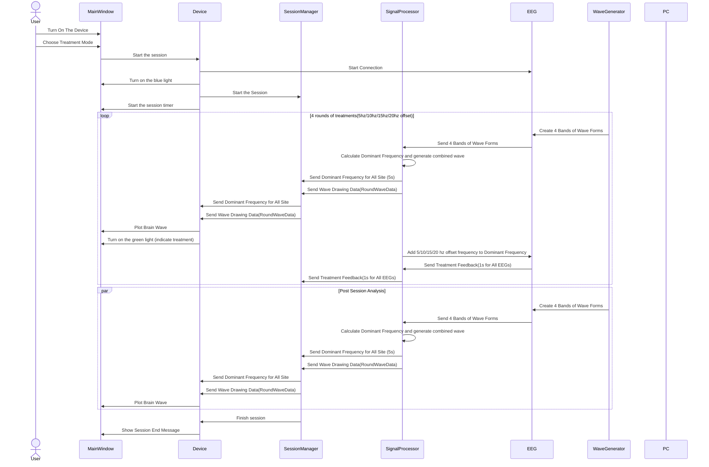
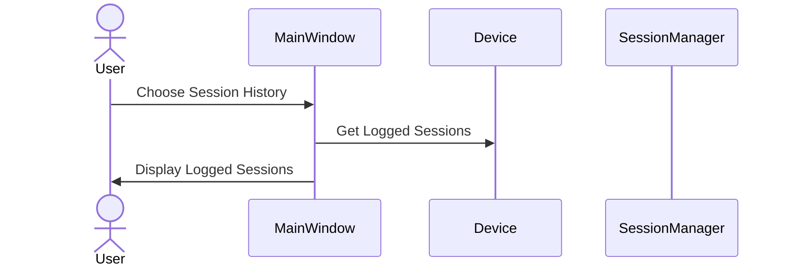
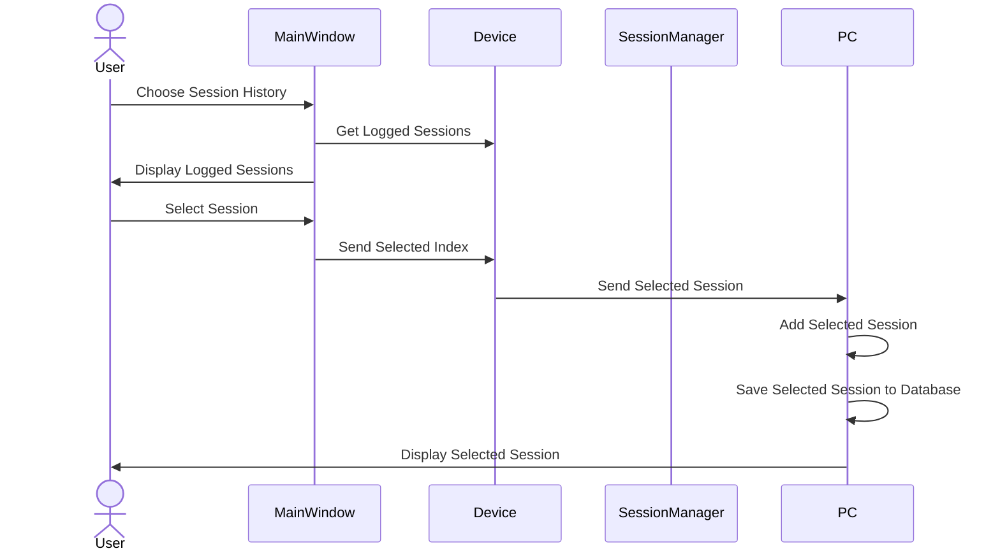
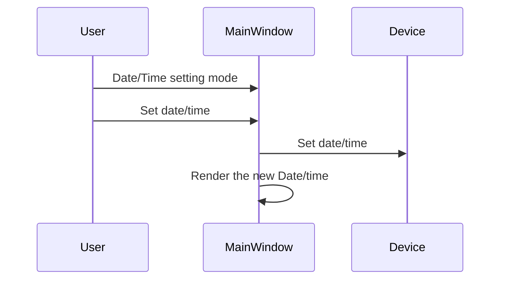
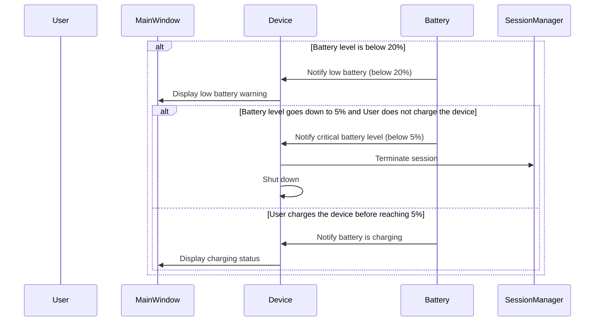
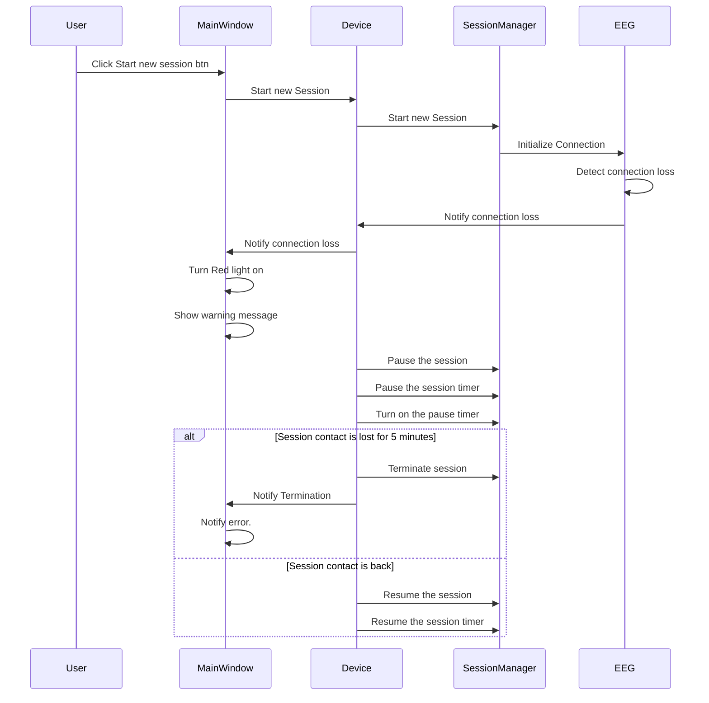
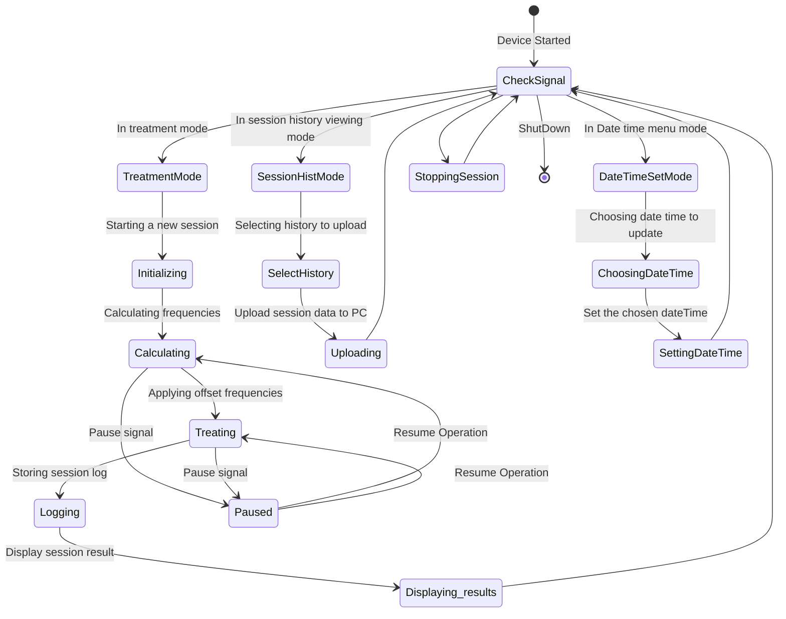

# OO Design model

## UML Sequence Diagram

### Use Case 1: Treatment Session

---

### Use Case 2: View Time and Date of the Sessions on the Device

---

### Use Case 3: Upload Session Log History to a PC

---

### Use Case 4: Setting Device Time and Date

---

### Use Case 5: Low Battery

---

### Use Case 6: Lost Connection

## UML Class Diagram

Presents the structure of the system with classes, attributes, operations, and the relationships among them.

```mermaid
classDiagram

   class MainWindow {
      - ui: Ui::MainWindow*
      - deviceThread: QThread*
	    - elapsedTimer: QTimer
	    - connLostTimer: QTimer
	    - connLostTimeSeconds: int
	    - elapsedTimeSeconds: int
	    - selectedSessionHist: int
	    - menuChoice: MenuOptions
      - deviceOn: bool
      - sessionPaused: bool
      - sessionStarted: bool

	    %% signals
	    + startNewSession() void
      + pauseSession() void
      + resumeSession() void
      + stopSession() void
      + sendDataToTestUI(QMap<QPair<int, QString>, QList<float> >) void

	    %% slots
	    - chooseMenu(MenuOptions) void
	    - togglePower() void
	    - playPressed() void
	    - pausePressed() void
	    - stopPressed() void

	    - startTimer() void
	    - stopTimer() void
	    - pauseTimer() void

	    - startDevice() void
	    - shutDown() void
	    - updateBatteryLevel() void

	    - handleConnectionLost(QString) void
	    - handleSessionTerm() void
	    - handleConnectionBack(QString) void
	    - handleRoundWaveData(QMap<QPair<int, QString>, QList<float> >) void
	    - phaseUpdate(PHASES, int) void
	    - updateProgress(int) void
	    - viewDeviceSession() void
	    - on_tableView_clicked(QModelIndex) void
		}


    class Device {
	    - eegList: QList<EEG*>
      - currentDateTime: QDateTime
      - loggedSessionList: QList<QMap<QString, QVariant>>
      - dominantFrequencyData: QMap<QString, QList<float>>
      - battery: Battery*

			%% slots
			+ startSession() bool
      + pauseSession() void
      + resumeSession() void
      + stopSession() void
      + receiveEEGConnLoss(EEG*) void
      + receiveEEGConnBack(EEG*) void
      + onSessionFinished(int) void
      + chargeBattery(int) void
      + setDateTime(QDateTime) void
      + getBatteryLevel() int

      + handleDominantFrequency(QDateTime dateTime, QMap<QString, QList<float>>) void
      + handleRoundWaveData(QMap<QPair<int, QString>, QList<float>>) void
      + receiveSessionPhase(PHASES, int) void
      + getLoggedSessions() QList<QMap<QString, QVariant>>
      + onUploadToPCPressed(int) void

			%% siganls
			+ startDisplayTimer() void
      + sendConnLossToGUI(QString) void
      + sendConnBackToGUI(QString) void
      + sendStartToSession(QList<EEG*>) void
      + sendPauseToSession() void
      + sendResumeToSession() void
      + sendStopToSession() void
      + sendSessionTermToGUI() void
      + sendLoggedSessions() void
      + sendRoundDataToMainWindow(QMap<QPair<int, QString>, QList<float> >) void
      + sendDataToTestUI(QMap<QPair<int, QString>, QList<float> >) void
      + phaseProgress(PHASES, int) void
      + sendSessionInfoToPC(QMap<QString, QVariant>) void

    }


    class SessionManager{
		  - startTime: QDateTime
      - currentRound: int
      - therapyStatus: int
      - eegList: QList<EEG*>
      - dominantFrequency: QList<float>
      - dominantFrequencyMap: QMap<QString, QList<float>>
      - roundWaveData: QMap<QPair<int, QString>, QList<float>>
      - roundWaveDataList: QList<QMap<QPair<int, QString>, QList<float>>>
      - isFinished: bool

      + runSession(QList<EEG*>, int) void

      %%signals:
      + dominantFrequencyReady(QDateTime, QMap<QString, QList<float>> ) void
      + roundDataReady(QMap<QPair<int, QString>, QList<float>> ) void
      + sessionFinished(int) void
      + sendPhaseToDevice(PHASES, int) void

      %% slots:
      + onSessionStarted(QList<EEG*>) void
      + onSessionPaused() void
      + onSessionResumed() void
      + onSessionStopped() void
      - handleRoundWaveData(QList<EEGWaveMap>) void
      - handleDominantFrequency(QList<EEGDomFreq>) void
    }


    class EEG {
      - waveMap QMap<QString, QList<float>>
      - ampFreqMap QMap<QString, QPair<float, float>>
      - index int
      - isConnected bool
      - waveGenerator WaveGenerator*

	    + startConnection() bool
      + stopConnection() bool
      + generateWave() void
      + getWaveMap() QMap<QString, QList<float>>
      + getAmpFreqMap() QMap<QString, QPair<float, float>>

	    %%signals
		  + sendConnLossToDevice(EEG*): void
		  + sendConnBackToDevice(EEG*): void
    }


		class SignalProcessor {
      - eegDomFreqList QList<EEGDomFreq>
      - eegWaveMapList QList<EEGWaveMap>

		  - calculateDominantFrequency(QMap<QString, QPair<float, float>>) float
		  + processDominantFrequency(QList<EEG*>) void

    %% signals:
      + sendDominantFrequencyToSM(QList<EEGDomFreq>) void
      + sendWaveMapToSM(QList<EEGWaveMap>) void

		}

		class PC {
			- tableWidget QTableWidget*
      - sessionInfoDisplay QVBoxLayout*
      - currentTableIndex int
      - uploadedSessions QList<QMap<QString, QVariant>>

      - displaySession(QMap<QString, QVariant>) void
      - saveSessionToDatabase(QMap<QString, QVariant>) void
      - removeDatabase() void

      %% slots:
      + onPreviousPressed() void
      + onNextPressed() void
      + handleSessionInfoData(QMap<QString, QVariant>) void
		}


		class TestUI {
			- ui Ui::TestUI*
      - plot QCustomPlot
      - sessionWaveData QMap<int, QMap<QPair<int, QString>, QList<float>>>
      - currentRound int

      + clearData() void

		 %% slots:
      + updateData(QMap<QPair<int, QString>, QList<float> >) void
      - updatePlot() void
		}


    class Battery {
      - batteryLevel: int

	    + reduceBattery(int) void
	    + chargeBattery(int) void
    }

    class WaveGenerator{
      - eegIndex int
      - ampFreqMap QMap<QString, QPair<float, float>>
      - waveMap QMap<QString, QList<float>>

      - generateBetaWave() QList<float>
      - generateAlphaWave() QList<float>
      - generateThetaWave() QList<float>
      - generateDeltaWave() QList<float>

      + generateWave() QMap<QString, QList<float>>
      + getAmpFreqMap() QMap<QString, QPair<float, float>>
      + generateCustomWave(int, int, QString) QList<float>
    }

    %% add composition relationships:
    %% A --* B: B contains A
		Device --* MainWindow
		SessionManager --* Device
		EEG --* Device
		Battery --* Device
		PC --* MainWindow
		TestUI --* MainWindow
    SignalProcessor --* SessionManager
    WaveGenerator --* EEG
    WaveGenerator --* SignalProcessor
```

## UML State Machine Diagrams

Depicts the state changes of the device during different operational phases including initialization, treatment, pausing, and connection handling.

