# Use Case Model

## Use Case 1: Treatment Session

### Primary Actor

-   The user

### Stakeholders and Interests

-   **The user:** Wants to have a successful treatment.
-   **The device:** Aims to perform the treatment session successfully.

### Preconditions

-   The device is functioning normally.

### Success Guarantees

-   The device performs the treatment.
-   The device stores treatment data, including time, date, and before and after dominant average frequencies, for future retrieval.

### Main Success Scenario

1. The user selects "New Session" from the device menu and presses the play button.
2. The device connects to 21 EEG sites and turns on the blue light.
3. The menu changes to a timer and a progress bar, showing the approximate time remaining and the session progress by percentage.
4. The device measures an overall baseline from all 21 EEG sites to establish an initial baseline.
5. The device performs treatment for one EEG site by adding 5 Hz to the baseline measured and delivers the electromagnetic signal repeatedly over 1 second while the green light flashes.
6. Steps 4 and 5 are repeated for all EEG sites.
7. The device measures an overall baseline from all 21 EEG sites to establish a final baseline.
8. The device finalizes the process by storing date, time, and before and after dominant average frequencies, disconnecting from the EEG sites, turning off the blue light, and changing the menu back to the initial menu.

### Extensions

a. **Pausing the Treatment:**

1. The user presses the pause button during a treatment session.
2. The treatment is paused.
3. To resume, the user presses the play button. If not pressed within 5 minutes, the session is terminated automatically, and the device turns off without storing any data.

b. **Stopping the Treatment:**

1. The user presses the stop button.
2. The treatment is terminated without data storage.

---

## Use Case 2: View Time and Date of the Sessions on the Device

### Primary Actor

-   The user

### Stakeholders and Interests

-   **The user:** Wants to view the time and date of the sessions on the device successfully.
-   **The device:** Ensures the user can successfully view the time and date of the sessions.

### Preconditions

-   The device is working in a normal condition.

### Success Guarantee

-   The user successfully views the time and date of the sessions on the device.

### Main Success Scenario

1. The user presses the session log button.
2. A list of sessions, with each session's time and date, is displayed in the menu.
3. The user scrolls through the list to find the desired session.
4. The user views the time and date of the session.

---

## Use Case 3: Upload Session Log History to a PC

### Primary Actor

-   The user

### Stakeholders and Interests

-   **The user:** Wants to successfully upload session log history to a PC.
-   **The device:** Ensures the user can successfully upload session log history to the connected PC.

### Preconditions

-   The device is working in a normal condition and connected to the user's PC.

### Success Guarantee

-   The user successfully uploads session log history to a PC to view more information about the session.

### Main Success Scenario

1. The user presses the session log button.
2. A list of sessions, with each session's time and date, is displayed in the menu.
3. The user scrolls through the list to find the desired session.
4. The user clicks the session they want to upload.
5. The user presses the "UPLOAD SESSION" button to upload the session's information to the connected PC.
6. The user views information about the session, including the date and time log, and the before and after baselines, on the connected PC.

---

## Use Case 4: Setting Device Time and Date

### Primary Actor

-   The user

### Stakeholders and Interests

-   **The device**
-   **The user**

### Preconditions

-   The device needs to be turned on and not running in other modes. It should be in the date/time setting mode.

### Success Guarantee (Post-conditions)

-   The user can set the date/time from the setting mode, and the set time is saved even after exiting the date/time mode. The time is recorded onwards.

### Main Success Scenarios

1. The user uses the menu navigation button to navigate to the date/time setting menu option.
2. The user presses the set (play) button to select the date/time menu mode.
3. The DD part of the date is highlighted by clicking it, and the up/down navigation button or typing the new day adjusts the DD.
4. The same process is used to change months, year, and time.
5. The set values are saved when the "Play" button is pressed.

### Extensions

-   **Device goes off when setting date/time:** The previously stored date/time is retained.

---

## Use Case 5: Low Battery

### Primary Actor

-   The device

### Stakeholders and Interests

-   **The user:** Wants to be notified of low battery to prevent the device from shutting down unexpectedly.
-   **The device:** Ensures continuous operation and data integrity by alerting the user about low battery status.

### Preconditions

-   The device is working in a normal condition.

### Success guarantees

-   The user is informed about the low battery status.
-   The user charges the device to ensure its continuous operation.

### Main Success Scenario

1. The device detects the battery level is below a certain threshold (e.g., 20%).
2. A warning message indicating low battery status is displayed on the screen.
3. The user connects the device to a power source to charge.
4. The device charges, and session data is protected.

### Extensions

3a. **User does not charge the device:**

-   If the battery level drops to a critical threshold (e.g., 5%), the session is terminated, and the device turns off automatically without storing any data.

---

## Use Case 6: Lost Connection

### Primary Actor

-   The device

### Stakeholders and Interests

-   **The user:** Wants to be notified of lost connection to prevent unexpected session interruptions.
-   **The device:** Aims to maintain operational continuity and safeguard against data loss by notifying the user about connectivity issues promptly.

### Preconditions

-   The device is working in a normal condition.

### Success Guarantee

-   The user is informed about the connection loss status.

### Main Success Scenario

1. The device detects a disruption in its network connection.
2. A red light turns on, and a warning message is displayed, indicating the loss of connection.
3. The device attempts to restore the connection.
4. Once re-established, the device resumes normal operations without data loss or significant interruption.
5. If connection is lost for more than a certain threshhold (e.g. 10 seconds), the device stops its session and shuts down.
6. New session cannot be started until the connection is back.

---

## Use Case Diagram

```mermaid
flowchart LR
      uc1((Use Case 1: Treatment Session))
      uc2((Use Case 2: View Time and Date of the Sessions on the Device))
      uc3((Use Case 3: Upload Session Log History to a PC))
      uc4((Use Case 4: Setting Device Time and Date))
      uc5((Use Case 5: Low Battery))
      uc6((Use Case 6: Lost Connection))

    user[User👤]

    user-->uc1
    user-->uc2
    user-->uc3
    user-->uc4
    user-->uc5
    user-->uc6

    uc2 -. exclude .-> uc1
    uc3 -. exclude .-> uc1
    uc4 -. exclude .-> uc1
    uc5 -. exclude .-> uc1
    uc6 -. exclude .-> uc1
```

